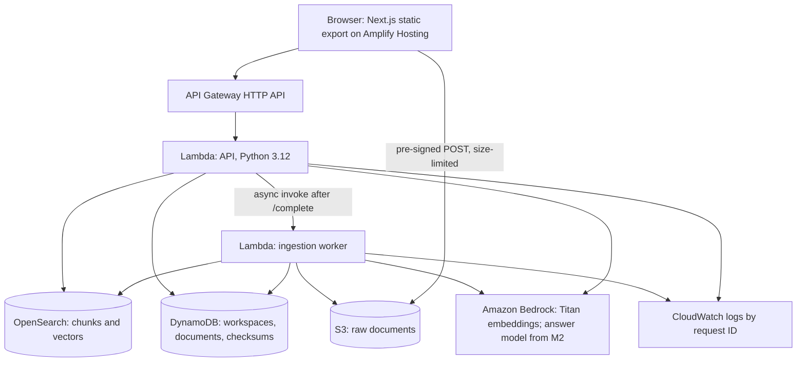

# CROWN-X

Evidence-first answers across evolving project documents. Upload the versions of a brief, a spec or an
organiser update, ask a question, and CROWN-X shows the passages behind the answer, where the sources
disagree, and which source is newer.

Built for AWS First Commit 2026 (Ship It track), 17-20 September 2026.

> **Status (17 September, day 1):** the walking skeleton (milestone M1) is in progress. The API,
> ingestion and retrieval code and the web app pass their unit tests and were checked in a local
> browser. **Nothing is deployed yet**: the new AWS account is still being verified, which blocks
> Bedrock calls. Answers, conflict detection and the timeline come in M2 to M4. Live state:
> [`docs/PROGRESS.md`](docs/PROGRESS.md).

## The problem
Project facts such as deadlines, owners and limits change across document versions and informal notes.
Generic document chat answers from whichever passage it happens to retrieve and doesn't mention that
another source says something else. Teams find out late.

CROWN-X is built around three rules:
- every factual answer cites evidence IDs that resolve to stored passages, or says the evidence is
  insufficient;
- deciding that two values conflict is deterministic code, never a model's judgement;
- retrieved document text is data: it can't change instructions, tools or permissions.

## What works today
- Create a workspace; its unguessable ID is the access key for the event.
- Upload Markdown or plain-text files (up to 5 MB) straight to S3 with a pre-signed POST; each file's
  card moves through upload, parsing and indexing to `Ready`, or says why it failed. Re-uploading the
  same content is detected by checksum.
- Ask a question: BM25 and k-NN retrieval, both filtered by workspace inside the query, fused with
  reciprocal rank fusion, return ranked passages with chunk IDs and character offsets.

Not built yet: written answers with citations (M2), contradiction detection and the conflict
inspector (M3), the value timeline and UI polish (M4).

## Architecture


| Service | Job in CROWN-X | Why this service |
|---|---|---|
| Amplify Hosting | Serves the static web app, redeploys on push | Git-connected, no servers to run |
| API Gateway (HTTP API) | API edge, CORS for the app's origins, throttling | Managed boundary, cheap per request |
| Lambda | API and ingestion worker, one least-privilege role each | Scales to zero between demos |
| S3 | Raw documents, uploaded directly from the browser | No file bytes through Lambda; S3 enforces the size limit |
| OpenSearch Service | BM25 and k-NN in one index, filtered by workspace | Hybrid search with metadata filters, idempotent writes by chunk ID (ADR-011) |
| Amazon Bedrock | Titan Text Embeddings V2; the answer model from M2 | Managed models scoped by IAM (ADR-013) |
| DynamoDB | Workspace and document records, checksum locks | Keyed by workspace, on-demand billing |
| CloudWatch | Structured logs carrying `request_id` | Every error shown in the UI can be found in the logs |

Everything runs in `ap-south-1` (ADR-012). Decisions and their reasons: [`docs/DECISIONS.md`](docs/DECISIONS.md).

## Repository
```text
apps/web/           Next.js App Router, TypeScript strict, Tailwind v4, static export
services/api/       Python 3.12 Lambdas: domain/ (pure logic), adapters/ (AWS), app/ (handlers)
infra/template.yaml AWS SAM template for the whole backend
amplify.yml         Amplify build settings and security headers
demo/               the demo scenario; seeded documents from M2
docs/               PRD, SRS, architecture, design system, decisions, progress
```

## Run it locally
Requirements: Node 22 with pnpm 10, Python 3.12 through [uv](https://docs.astral.sh/uv/), and for
deploying, the AWS CLI and SAM CLI.

```bash
cd services/api && uv sync && uv run pytest -q
```

```bash
cd apps/web && pnpm install --frozen-lockfile && pnpm test && pnpm build
```

The web app reads the API address from `NEXT_PUBLIC_API_URL` at build time; `pnpm dev` in `apps/web`
starts it on port 3000. Deployment steps are in the S1 runbook in [`docs/PROGRESS.md`](docs/PROGRESS.md).

## Limitations
- No accounts: the workspace ID in the link is the only access control during the event
  ([`docs/SECURITY.md`](docs/SECURITY.md) §3). Share a workspace link only with people who should see it.
- Conflicts are found only for wording in the vocabulary (`services/api/src/crownx/domain/vocabulary.py`):
  submission deadline, Events Portal rate limit, budget cap, deployment owner, and the Robotics Expo
  entries date.
  - Dates, numbers and owners only. Requirement text and free-text categories aren't compared.
  - A question that doesn't name the fact shows no conflict card, so a conflict can be missed, but
    one is never invented.
  - See ADR-020.
- Measured figures are in [`docs/BENCHMARKS.md`](docs/BENCHMARKS.md), each labelled offline or live.

## Credits
AI coding tools, third-party components and licences: [`CREDITS.md`](CREDITS.md). MIT licence:
[`LICENSE`](LICENSE).

## Working with Claude Code

| Feature | How this repository uses it | Why |
|---|---|---|
| `CLAUDE.md` | Rules that each name what enforces them; commands; how to work | Loaded every session, so it's short |
| Skills | Workflows you invoke (`disable-model-invocation`), domain rules Claude loads by description | Detail loads only when used; commands are merged into skills |
| Subagents | Four read-mostly specialists with tool limits and output formats | Isolate context-heavy review and verification; building stays in the main session |
| Hooks | SessionStart context, PreToolUse guards (JSON decisions), PostToolUse format, Stop gate (exit 2, loop-safe) | Deterministic enforcement that doesn't rely on memory |
| Permissions | Deny `.env`, keys, force-push; ask before push, deploy, AWS deletes | Safety without a prompt for every routine command |
| MCP | Playwright for real-browser checks; AWS docs for Bedrock, SAM and OpenSearch questions | "Verified live" means a browser, not a status code |
| Bundled skills | `/run-skill-generator` in M1, `/code-review` before closing a milestone, `/rewind` | Built in; no need to re-create them |
| Plan mode | `/milestone` plans before building | Scope is agreed before code |

**Opus 5 notes.**
- Instructions are plain and give reasons, instead of shouting in capitals.
- Delegation happens only for independent, context-heavy work.
- Independent reads and checks run in parallel.
- Progress lives in files and git, not in the conversation.
- Skills that deserve more thought set `effort: high`.

### The daily loop
```text
/resume                 where things stand: ledger + git, reconciled
/milestone M3           loads prompts/03-…, plans (plan mode) → build → verify → persist → commit
/verify-stage M3        gates with PASS / FAIL / NOT TESTED evidence
/record-decision …      whenever a material choice is made
/aws-ship deploy        when a milestone needs to be live (asks before deploying)
/release                Sunday: freeze, writeup, video check, submit early
```
