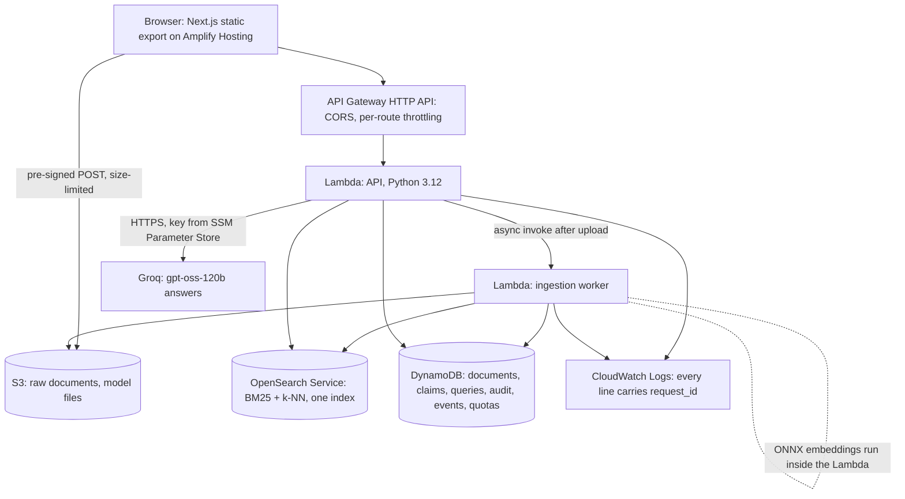

# CROWN-X

**Ask your project documents a question and see where they disagree.** CROWN-X answers from the
passages it cites. When two versions of a brief, a spec or an organiser email give different values
for the same fact, it shows both sources, which one is current and the rule that decided it.

For student and project teams whose deadlines, limits and owners change across document versions,
chat threads and notes. Built for AWS First Commit 2026, Ship It track, 17-20 September 2026.


## Try it
- **App:** https://main.d1jy52bqj8dt1h.amplifyapp.com/
- **Demo workspace**, with the six demo documents already ingested:
  https://main.d1jy52bqj8dt1h.amplifyapp.com/app/?ws=ws_KFdHFNj0IPUoOs4pQDcMUQ
  - Press Ctrl+K and ask **"What is the current submission deadline?"**.
  - Open the conflict inspector, then the timeline.
- Or start a new workspace from the home page and upload your own Markdown, text or PDF files.

## The problem
Project facts change across document versions and informal notes. The brief says submissions close
on 20 September, and an organiser email moves it to 22 September. Generic document chat answers from
whichever passage it happens to retrieve, and it doesn't mention that another source says something
else. Teams find out late.

CROWN-X is built on three rules, each enforced by tests:
- **Evidence or nothing.** Every factual answer cites evidence IDs that resolve to stored passages,
  or says the evidence is insufficient.
- **Code decides conflicts.** Deciding that two values conflict is deterministic code, never a
  model's judgement.
- **Documents are data.** Retrieved document text can't change instructions, tools or permissions.

## How it works
**The evidence pipeline:**
1. **Upload.** Files go straight from the browser to S3 with a size-limited pre-signed POST.
2. **Ingest.** An ingestion Lambda parses Markdown, text or PDF and splits it into passages with
   character offsets. It embeds them with a local ONNX model (bge-small, inside the Lambda) and
   indexes them in OpenSearch for both BM25 and k-NN search.
3. **Retrieve.** A question is two calls (ADR-009). The first retrieves: BM25 and k-NN, each filtered
   by workspace inside the query, fused by reciprocal rank fusion. The passages are stored.
4. **Answer.** The second call writes the answer with `openai/gpt-oss-120b` on Groq, over exactly
   those stored passages. They're given as an escaped data block, never as instructions. Code then
   checks every citation against the retrieved set, and drops any sentence that cites nothing or
   cites a passage that was never retrieved.

**The deterministic conflict predicate (ADR-003, ADR-020).**
- At ingestion, rules extract typed claims: a vocabulary trigger plus a date, number or owner in the
  same sentence, normalized ("22 Sept" is 2026-09-22; "60 rpm" is "60 requests per minute").
- Two claims conflict when all of these hold: same fact, same type, both normalized, same unit,
  different documents, different values.
- The current value is chosen by a written rule, whichever applies first:
  1. the newest source date;
  2. version order within one document family;
  3. the latest upload, which is the weakest rule and is named as such;
  4. none: with no ordering signal, nothing is selected.
- The answer card, the conflict inspector and the timeline are all rendered from this data, never
  from the model's text.

**Workflow Learning Lite (ADR-018, ADR-022).**
- CROWN-X records what people do in a workspace (ask, inspect a conflict, open the timeline, copy an
  answer) as events holding IDs only.
- A deterministic miner finds step sequences that repeat. They're shown as a suggestion with the
  exact events behind them: "Finished 3 of the 8 times it started this way", never a bare
  percentage.
- A model only names what code already found. Saving keeps a versioned template, and nothing runs
  automatically.

## Architecture


| AWS service | Job in CROWN-X | Why this service |
|---|---|---|
| Amplify Hosting | Serves the static web app, rebuilding on each push | Git-connected deploys with no server to run (ADR-014) |
| API Gateway (HTTP API) | API edge: CORS for the app's origins, per-route throttling | Managed boundary, cheap per request; the throttles are a cost control (ADR-021) |
| Lambda | The API and the ingestion worker, one least-privilege IAM role each; the ONNX embedding model runs inside | Scales to zero between demos; local embeddings add no per-call cost (ADR-017) |
| S3 | Raw documents uploaded straight from the browser, and the pinned model files | No file bytes pass through Lambda, and S3 enforces the size limit on upload |
| OpenSearch Service | BM25 and vector search in one index, filtered by workspace inside every query | Hybrid retrieval with metadata filters in a single store (ADR-011) |
| DynamoDB | Workspaces, documents, claims, stored queries, audit records, workflow events, hourly quota counters (with TTL) | Everything is keyed by workspace; on-demand billing |
| CloudWatch Logs and Logs Insights | Structured logs with `request_id` and per-stage latency; saved queries find any failed request | Every error the UI shows can be traced from its request ID |
| SSM Parameter Store | Holds the Groq API key as a SecureString, read once per cold start | The key never enters the repo, the template or the logs |
| IAM, CloudFormation (AWS SAM) | One role per function, scoped to its resources; the whole backend is one template | Reviewable least privilege (SECURITY T4); repeatable deploys |

Everything runs in `ap-south-1` (ADR-012).

**Why the answers use Groq rather than Bedrock.** On day one, the new AWS account could list Bedrock
models, but every inference call was denied while the account was being verified, with quotas at
zero. Rather than stall the milestone, the answer model moved to Groq and embeddings to a local ONNX
model. Both sit behind one provider interface, so Bedrock stays a configuration switch (ADR-013,
ADR-017).

**Cost guardrails:**
- One model call per question, and none when no evidence was found.
- Local embeddings, so indexing makes no model calls.
- A single-node OpenSearch domain.
- Upload size and per-workspace document limits.
- 60 questions and 60 model answers per workspace per hour, counted in DynamoDB before any work is
  done.
- Per-route API throttling.
- Lambda reserved concurrency isn't possible on this account, whose limit is 10 (ADR-021).

Decisions and their reasons: [`docs/DECISIONS.md`](docs/DECISIONS.md).

## Measured results
Final evaluation at the freeze (tag `freeze-1`, 2026-09-19). "Live" means the deployed stack with the
real providers. Commands, result files, every run (including the weaker ones) and how each figure is
defined: [`docs/BENCHMARKS.md`](docs/BENCHMARKS.md).

| What | Result | Where measured |
|---|---:|---|
| Contradiction precision / recall on the demo scenario (6 conflicting pairs, 4 facts) | 1.0 / 1.0 | offline and live |
| Current value and rule chosen correctly | 4 of 4 facts | offline and live |
| Values that differ only in format flagged as conflicts | 0 | offline and live |
| Security gate: citation validity, workspace isolation, prompt injection, no model call without evidence | 1.0 each | offline and live |
| Golden set (40 questions): case pass rate / answer value match | 0.95 / 1.0 | live |
| Conflict questions answered with status `conflict` | 7 of 7 | live |
| Retrieval benchmark (60 passages, 30 queries incl. Hinglish): recall@5 / recall@8 / MRR | 0.917 / 0.95 / 0.747 | live |
| Query / answer latency inside Lambda, p50 / p95 | 39 / 65 ms, 731 / 1153 ms | live, CloudWatch |
| Workflow miner on labelled synthetic traces: precision / recall | 1.0 / 1.0 | offline, our own benchmark |

The scenario, the golden set and the workflow benchmark were written by us, so they show that the
system does what it claims on known cases. They are not a measure of accuracy on anyone else's
documents.

## Repository
```text
apps/web/           Next.js App Router, TypeScript strict, Tailwind v4, static export; e2e/ Playwright
services/api/       Python 3.12 Lambdas: domain/ (pure logic), adapters/ (AWS, Groq, ONNX), app/ (handlers)
infra/template.yaml AWS SAM template for the whole backend
evals/              golden sets, the retrieval and workflow benchmarks, and their results
demo/               the demo scenario and its documents; seed.py loads them through the API
docs/               PRD, SRS, architecture, design, decisions, benchmarks, progress, writeup
```

## Run it locally
Requirements: Node 22 with pnpm 10, and Python 3.12 through [uv](https://docs.astral.sh/uv/). For
deploying, you also need the AWS CLI and the SAM CLI.

```bash
cd services/api && uv sync && uv run pytest -q
```

```bash
cd apps/web && pnpm install --frozen-lockfile && pnpm test && pnpm build
```

```bash
cd services/api && uv run python ../../evals/run.py --offline
```

- **Web app.** It reads the API address from `NEXT_PUBLIC_API_URL` at build time. `pnpm dev` in
  `apps/web` serves it on port 3000.
- **Browser tests.** `pnpm e2e` runs the `@critical` tests against the static build with recorded
  API responses.
- **Deploying.** `sam build` and `sam deploy` from `infra/`, with the parameters in
  [`docs/HANDOFF.md`](docs/HANDOFF.md). Then load the demo with
  `python demo/seed.py --api <ApiUrl>`.

The deployed stack needs OpenSearch and a Groq key, so there's no fully local run: this is a Ship It
submission.

## Limitations
- **No accounts.** The workspace ID in the link is the only access control during the event
  ([`docs/SECURITY.md`](docs/SECURITY.md) §3). Share a workspace link only with people who should
  see it.
- **Conflicts are found only for wording in the vocabulary**
  (`services/api/src/crownx/domain/vocabulary.py`): the submission deadline, the Events Portal rate
  limit, the budget cap, the deployment owner, and the Robotics Expo entries date.
  - Dates, numbers and owners only. Requirement text and free-text categories aren't compared.
  - A question that doesn't name the fact shows no conflict card, so a conflict can be missed, but
    one is never invented (ADR-020).
- **English only.** Hinglish questions are part of the retrieval benchmark, but claim extraction and
  the conflict vocabulary are English.
- **A true fact next to an injection is refused.** If a fact sits in the same passage as text
  addressed to an assistant ("ignore previous instructions..."), it isn't used: code distrusts the
  whole passage, so the answer may say there isn't enough evidence. An injection in its own passage
  or document changes nothing (SECURITY T1).
- **Hourly limits.** Each workspace can ask 60 questions, and get 60 model-written answers, per clock
  hour. Going over returns "limit reached" with the minutes left (ADR-021).
- **Workflow suggestions** come from our own synthetic benchmark and one live demo trace. They
  haven't been tested with real teams.
- **Every figure is measured.** Each number is in [`docs/BENCHMARKS.md`](docs/BENCHMARKS.md), with
  its command, commit and date, labelled offline or live.

## Credits and AI tools
Built with **Claude Code (Claude Opus 5)** and **GitHub Copilot**. The models the product runs, the
third-party components and their licences are in [`CREDITS.md`](CREDITS.md). The project writeup is
[`docs/WRITEUP.md`](docs/WRITEUP.md). MIT licence: [`LICENSE`](LICENSE).

## Working with Claude Code

| Feature | How this repository uses it | Why |
|---|---|---|
| `CLAUDE.md` | Rules that each name what enforces them; commands; how to work | Loaded every session, so it's short |
| Skills | Workflows you invoke (`disable-model-invocation`), domain rules Claude loads by description | Detail loads only when used; commands are merged into skills |
| Subagents | Four read-mostly specialists with tool limits and output formats | Isolate context-heavy review and verification; building stays in the main session |
| Hooks | SessionStart context, PreToolUse guards (JSON decisions), PostToolUse format, Stop gate (exit 2, loop-safe) | Deterministic enforcement that doesn't rely on memory |
| Permissions | Deny `.env`, keys, force-push; ask before push, deploy, AWS deletes | Safety without a prompt for every routine command |
| MCP | Playwright for real-browser checks; AWS docs for Bedrock, SAM and OpenSearch questions | "Verified live" means a browser, not a status code |
| Bundled skills | `/run-skill-generator` in M1, `/code-review` before closing a milestone, `/rewind` | Built in; no need to re-create them |
| Plan mode | `/milestone` plans before building | Scope is agreed before code |

**Opus 5 notes.**
- Instructions are plain and give reasons, instead of shouting in capitals.
- Delegation happens only for independent, context-heavy work.
- Independent reads and checks run in parallel.
- Progress lives in files and git, not in the conversation.
- Skills that deserve more thought set `effort: high`.

### The daily loop
```text
/resume                 where things stand: ledger + git, reconciled
/milestone M3           loads prompts/03-…, plans (plan mode) → build → verify → persist → commit
/verify-stage M3        gates with PASS / FAIL / NOT TESTED evidence
/record-decision …      whenever a material choice is made
/aws-ship deploy        when a milestone needs to be live (asks before deploying)
/release                Sunday: freeze, writeup, video check, submit early
```
