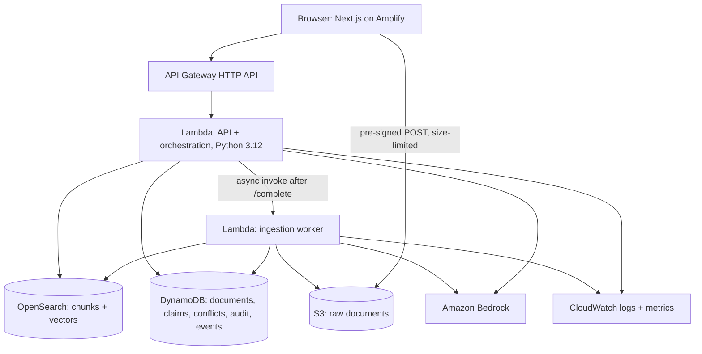
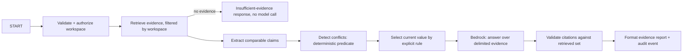
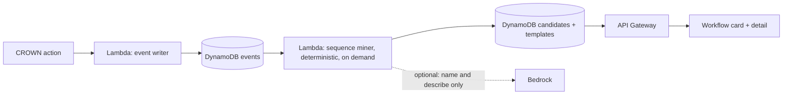

# CROWN-X architecture

## 1. Goal
A simple, inspectable pipeline, not a swarm of agents. Judges reward a working product, and a
deterministic graph with a few model calls is easier to test, debug, explain and keep within budget.

## 2. System (AWS, Ship It track)

| Service | Responsibility | Why this service |
|---|---|---|
| Amplify Hosting | Web app | URL in minutes, Git-connected deploys |
| API Gateway (HTTP API) | API edge, CORS, throttling | Managed boundary, cheap per request |
| Lambda | API, orchestration, ingestion | Scales to zero for a four-day event |
| S3 | Raw documents, pre-signed uploads | Durable, no file bytes through Lambda |
| OpenSearch | Lexical + vector retrieval | Hybrid search with metadata filters in one store |
| Bedrock | Embeddings, claim normalization help, answer generation | Managed models, IAM-scoped |
| DynamoDB | Metadata, claims, conflicts, audit, events | Key-value by workspace, on-demand billing |
| CloudWatch | Logs, metrics, request tracing by ID | Proof for the video and debugging |
| IAM | One role per function | Least privilege, reviewable |

**Build It fallback** (if cloud deployment becomes the bottleneck): the same code on SAM Local and
OpenSearch in Docker, per the event's Build It track. Decided in M1, recorded as an ADR.

## 3. Request orchestration

The flow runs as two HTTP calls (ADR-009). `POST /query` covers validate → retrieve → conflicts
(claims and conflicts are precomputed at ingestion) and stores the evidence IDs. `POST /answer` covers
selection → Bedrock → citation validation over exactly those IDs. API Gateway can't stream a Lambda
response, and two calls let the UI show real stages.

Request state: `request_id`, `workspace_id`, `question`, `retrieved_evidence`, `claims`, `conflicts`,
`selection`, `answer_draft`, `validated_claims`, `status`, `errors`, `timings`.

## 4. Contradiction contract (ADR-003)
1. Retrieve candidate passages for the question's subject.
2. Extract claims `(subject, attribute, normalized_value, unit, source_chunk_id, source_timestamp)`.
   Rules first (dates, numbers with units); a model may propose normalization for free text.
3. Compare only claims with the same subject and attribute and a comparable type.
4. Flag a conflict only with evidence on both sides.
5. Select the current value: source timestamp, then version label order, then upload time. No
   ordering signal means no selection.
6. Return the conflict object with both claims, type, severity and the rule used.

The model never decides that two values conflict. Deterministic code applies the predicate.

## 5. Evidence object
`evidence_id`, `document_id`, `chunk_id`, `source_uri`, `version_label`, `source_timestamp`,
`page_or_section`, `quoted_span`, `char_start`, `char_end`, `retrieval_rank`, `retrieval_score`.

## 6. Failure modes
| Failure | Behaviour |
|---|---|
| No evidence | Insufficient-evidence answer; no model call |
| Conflicting evidence | Surface the conflict; never hide it |
| Model timeout | One retry if idempotent, then a recoverable error with `request_id` |
| OpenSearch unavailable | Explicit degraded state in UI and API |
| Malformed upload | Rejected with an actionable message |
| Ingestion failure | Document status `failed` with reason; retry action |

## 7. Retrieval store choice (decide in M1 with today's prices, record as an ADR)
| Option | For | Against |
|---|---|---|
| OpenSearch Serverless (vector collection) | No cluster to size; fast to start | Billed per OCU-hour with a minimum; check the hourly cost against the credits |
| OpenSearch Service, small instance | Predictable cost; free-tier eligible instance types in some accounts | Cluster setup time on day 1 |
| Bedrock Knowledge Bases | Managed chunking and retrieval | Less control over chunk metadata and hybrid scoring, which the contradiction engine needs |

Whichever is chosen, the workspace filter is part of the query.

## 8. Web hosting note
The UI is client-driven: it calls API Gateway directly, so it ships as a static export
(`output: "export"`), which Amplify Hosting serves as a static site whatever the Next.js version.
Consequences: the workspace route takes its ID from the query string (`/app?ws=`), images are
unoptimized, and security headers (CSP and the rest) are set as Amplify custom headers, because a
static export can't set headers.

## 9. IAM and security
- One role per Lambda: the API role reads OpenSearch and DynamoDB and invokes the configured Bedrock
  model; the ingestion role reads its S3 prefix and writes OpenSearch and DynamoDB.
- No `*` actions or resources without an ADR. Bedrock permission scoped to the configured model or
  inference profile ARN.
- S3 block public access on; pre-signed URLs short-lived and scoped to one key.
- See `docs/SECURITY.md`.

## 10. Cost guardrails
- Upload size and count limits per workspace; bounded top-k; one answer call per question.
- API Gateway throttling; Lambda reserved concurrency on the query function.
- AWS Budgets alert on the credit balance. Log model token usage per request.
- Tear down after judging (`/aws-ship teardown`).

## 11. Configuration
Names only; values live in the environment, SAM parameters or SSM, never in the repo.

| Variable | Used by | Meaning |
|---|---|---|
| `AWS_REGION` | all | Deployment region: `ap-south-1` (ADR-012) |
| `BEDROCK_ANSWER_MODEL_ID` | API | Model or inference profile for answers (candidates in ADR-013) |
| `BEDROCK_EMBEDDING_MODEL_ID` | ingestion, API | Embedding model: `amazon.titan-embed-text-v2:0` (ADR-013) |
| `OPENSEARCH_ENDPOINT`, `OPENSEARCH_INDEX` | ingestion, API | Retrieval store |
| `DOCUMENTS_BUCKET` | API, ingestion | Raw document bucket |
| `TABLE_NAME` | API, ingestion | DynamoDB single table |
| `MAX_UPLOAD_BYTES`, `MAX_DOCUMENTS_PER_WORKSPACE`, `RETRIEVAL_TOP_K` | API | Limits |
| `ENVIRONMENT` | ingestion, API | `production` (default), `development`, `test` or `offline-demo` (ADR-016) |
| `ANSWER_PROVIDER`, `EMBEDDING_PROVIDER` | ingestion, API | `bedrock` (production), `mock`, `groq` (answers, development only); ADR-016 |
| `EMBEDDING_VERSION` | ingestion, API | Namespace version on every chunk; bump when chunking or embeddings change |
| `BEDROCK_ANSWER_FORCE_TOOL` | API | `true` forces `submit_answer`; `false` for models that accept only `auto` |
| `GROQ_API_KEY`, `GROQ_MODEL_ID` | API (development only) | Groq answer provider; the key only ever comes from the environment |
| `RETRIEVAL_SCORE_FLOOR` | API | Fused-score floor for evidence; 0 until calibrated on the golden set |
| `NEXT_PUBLIC_API_URL` | web | API Gateway base URL (public, not a secret) |
| `NEXT_PUBLIC_DEMO_WORKSPACE_ID` | web | Optional: the workspace behind "Open demo workspace" on `/` |

## 12. Workflow Learning Lite (M5, gated)

The model names and explains an already-detected pattern; it never invents the sequence. EventBridge is
post-hackathon.

## 13. Post-hackathon
Hybrid retrieval benchmark (BM25 + dense, reranker; Qdrant option), LangGraph durable orchestration,
read-only MCP server behind a permission layer, OpenTelemetry + Langfuse traces, MLflow evaluation runs.
