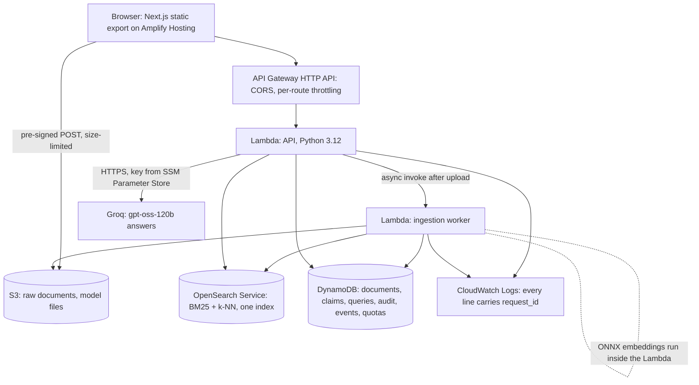
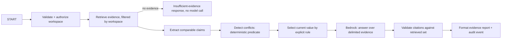
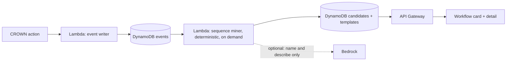

# CROWN-X architecture

## 1. Goal
A simple, inspectable pipeline, not a swarm of agents. Judges reward a working product, and a
deterministic graph with a few model calls is easier to test, debug, explain and keep within budget.

## 2. System (AWS, Ship It track), as built
The original plan used Bedrock for answers and embeddings. Since ADR-017, production answers come from
Groq (gpt-oss-120b, falling back to gpt-oss-20b) and embeddings from a local ONNX model inside the
Lambda; Bedrock stays a provider switch.



| AWS service | Job in CROWN-X | Why this service |
|---|---|---|
| Amplify Hosting | Serves the static web app, rebuilding on each push | Git-connected deploys with no server to run (ADR-014) |
| API Gateway (HTTP API) | API edge: CORS for the app's origins, per-route throttling | Managed boundary, cheap per request; the throttles are a cost control (ADR-021) |
| Lambda | The API and the ingestion worker, one least-privilege IAM role each; the ONNX embedding model runs inside | Scales to zero between demos; local embeddings add no per-call cost (ADR-017) |
| S3 | Raw documents uploaded straight from the browser, and the pinned model files | No file bytes pass through Lambda, and S3 enforces the size limit on upload |
| OpenSearch Service | BM25 and vector search in one index, filtered by workspace inside every query | Hybrid retrieval with metadata filters in a single store (ADR-011) |
| DynamoDB | Workspaces, documents, claims, stored queries, audit records, workflow events, hourly quota counters (with TTL) | Everything is keyed by workspace; on-demand billing |
| CloudWatch Logs and Logs Insights | Structured logs with `request_id` and per-stage latency; saved queries find any failed request | Every error the UI shows can be traced from its request ID |
| SSM Parameter Store | Holds the Groq API key as a SecureString, read once per cold start | The key never enters the repo, the template or the logs |
| IAM, CloudFormation (AWS SAM) | One role per function, scoped to its resources; the whole backend is one template | Reviewable least privilege (SECURITY T4); repeatable deploys |


**Build It fallback** (if cloud deployment becomes the bottleneck): the same code on SAM Local and
OpenSearch in Docker, per the event's Build It track. Decided in M1, recorded as an ADR.

## 3. Request orchestration

The flow runs as two HTTP calls (ADR-009). `POST /query` covers validate → retrieve → conflicts
(claims and conflicts are precomputed at ingestion) and stores the evidence IDs. `POST /answer` covers
selection → Bedrock → citation validation over exactly those IDs. API Gateway can't stream a Lambda
response, and two calls let the UI show real stages.

Request state: `request_id`, `workspace_id`, `question`, `retrieved_evidence`, `claims`, `conflicts`,
`selection`, `answer_draft`, `validated_claims`, `status`, `errors`, `timings`.

## 4. Contradiction contract (ADR-003)
1. Retrieve candidate passages for the question's subject.
2. Extract claims `(subject, attribute, normalized_value, unit, source_chunk_id, source_timestamp)`.
   Rules first (dates, numbers with units); a model may propose normalization for free text.
3. Compare only claims with the same subject and attribute and a comparable type.
4. Flag a conflict only with evidence on both sides.
5. Select the current value: source timestamp, then version label order, then upload time. No
   ordering signal means no selection.
6. Return the conflict object with both claims, type, severity and the rule used.

The model never decides that two values conflict. Deterministic code applies the predicate.

As built in M3 (ADR-020):
- **Claims.** At ingestion, `domain/claims.py` extracts claims by rule: a vocabulary trigger, then a
  typed value in the same sentence, normalized by `domain/normalize.py`. The claims are stored as
  `CLAIM#` items and replaced per document.
- **Conflicts.** `domain/conflicts.py` and `domain/selection.py` derive conflicts and the current
  value whenever `/query` or `GET /conflicts` reads the claims.
- **Relevance.** A conflict joins a query only if a conflicting claim's chunk was retrieved and the
  question names the fact (the key's `asks` terms in `domain/vocabulary.py`).
- **Answering.** The answer call receives the conflicts as an escaped data block. Code sets the
  status to `conflict`, and the UI renders the card from the conflict data.

## 5. Evidence object
`evidence_id`, `document_id`, `chunk_id`, `source_uri`, `version_label`, `source_timestamp`,
`page_or_section`, `quoted_span`, `char_start`, `char_end`, `retrieval_rank`, `retrieval_score`.

## 6. Failure modes
| Failure | Behaviour |
|---|---|
| No evidence | Insufficient-evidence answer; no model call |
| Conflicting evidence | Surface the conflict; never hide it |
| Model timeout | One retry if idempotent, then a recoverable error with `request_id` |
| OpenSearch unavailable | Explicit degraded state in UI and API |
| Malformed upload | Rejected with an actionable message |
| Ingestion failure | Document status `failed` with reason; retry action |

### Latency and diagnosis (M4)
Every API request writes one `request finished` line with:
- `route_key`, `status_code`;
- `latency_ms`, the end-to-end time inside the Lambda;
- `stage_ms`, the stages that ran: `upload_url`; `embed`, `search` and `compare` for a query;
  `answer_call` for an answer.

Ingestion writes one `ingestion stages` line per document with `stage_ms` (`read`, `parse`,
`embed`, `index`, `claims`) and `latency_ms`. Both come from the Powertools loggers, so the fields
are queryable. Run these in CloudWatch Logs Insights over `/aws/lambda/crownx-api` and
`/aws/lambda/crownx-ingest`.

p50 and p95 per API stage:
```text
filter message = "request finished" and status_code = 200
| stats count(*) as n,
        pct(latency_ms, 50) as p50_total, pct(latency_ms, 95) as p95_total,
        pct(stage_ms.embed, 50) as p50_embed, pct(stage_ms.embed, 95) as p95_embed,
        pct(stage_ms.search, 50) as p50_search, pct(stage_ms.search, 95) as p95_search,
        pct(stage_ms.answer_call, 50) as p50_answer, pct(stage_ms.answer_call, 95) as p95_answer,
        pct(stage_ms.upload_url, 50) as p50_upload_url, pct(stage_ms.upload_url, 95) as p95_upload_url
  by route_key
```

p50 and p95 per ingestion stage:
```text
filter message = "ingestion stages"
| stats count(*) as n, pct(latency_ms, 50) as p50_total, pct(latency_ms, 95) as p95_total,
        pct(stage_ms.parse, 95) as p95_parse, pct(stage_ms.embed, 95) as p95_embed,
        pct(stage_ms.index, 95) as p95_index, pct(stage_ms.claims, 95) as p95_claims
```

One request, by the ID the UI shows:
```text
fields @timestamp, @log, message, status_code, error_code, route_key, stage_ms, attempts
| filter @message like "req_<id from the UI>"
| sort @timestamp asc
```

Errors by code, for the last hour:
```text
filter message in ["answer not written", "request finished"] and status_code >= 400
| stats count(*) by status_code, error_code, route_key
```

**Diagnosis drill** (the video uses it):
1. Trigger an error in the UI. The error card shows `Request ID req_...` in mono, and the ID is
   selectable.
2. Copy it, open Logs Insights in ap-south-1, and pick both log groups.
3. Run "One request" with that ID. The lines show:
   - the route, and the status code with its error code;
   - each stage's time;
   - for an answer, each model attempt and its outcome (for example `rate_limited` then `ok`).
4. The API Gateway access log (`HttpApiAccessLogGroup`) has the same `request_id`, with its
   integration error when the Lambda itself failed.

## 7. Retrieval store choice (decide in M1 with today's prices, record as an ADR)
| Option | For | Against |
|---|---|---|
| OpenSearch Serverless (vector collection) | No cluster to size; fast to start | Billed per OCU-hour with a minimum; check the hourly cost against the credits |
| OpenSearch Service, small instance | Predictable cost; free-tier eligible instance types in some accounts | Cluster setup time on day 1 |
| Bedrock Knowledge Bases | Managed chunking and retrieval | Less control over chunk metadata and hybrid scoring, which the contradiction engine needs |

Whichever is chosen, the workspace filter is part of the query.

## 8. Web hosting note
The UI is client-driven: it calls API Gateway directly, so it ships as a static export
(`output: "export"`), which Amplify Hosting serves as a static site whatever the Next.js version.
Consequences: the workspace route takes its ID from the query string (`/app?ws=`), images are
unoptimized, and security headers (CSP and the rest) are set as Amplify custom headers, because a
static export can't set headers.

## 9. IAM and security
- One role per Lambda: the API role reads OpenSearch and DynamoDB and invokes the configured Bedrock
  model; the ingestion role reads its S3 prefix and writes OpenSearch and DynamoDB.
- No `*` actions or resources without an ADR. Bedrock permission scoped to the configured model or
  inference profile ARN.
- S3 block public access on; pre-signed URLs short-lived and scoped to one key.
- See `docs/SECURITY.md`.

## 10. Cost guardrails
- Upload size and count limits per workspace; bounded top-k; one answer call per question.
- API Gateway throttling; Lambda reserved concurrency on the query function.
- AWS Budgets alert on the credit balance. Log model token usage per request.
- Tear down after judging (`/aws-ship teardown`).

## 11. Configuration
Names only; values live in the environment, SAM parameters or SSM, never in the repo.

| Variable | Used by | Meaning |
|---|---|---|
| `AWS_REGION` | all | Deployment region: `ap-south-1` (ADR-012) |
| `BEDROCK_ANSWER_MODEL_ID` | API | Model or inference profile for answers (candidates in ADR-013) |
| `BEDROCK_EMBEDDING_MODEL_ID` | ingestion, API | Embedding model: `amazon.titan-embed-text-v2:0` (ADR-013) |
| `OPENSEARCH_ENDPOINT`, `OPENSEARCH_INDEX` | ingestion, API | Retrieval store |
| `DOCUMENTS_BUCKET` | API, ingestion | Raw document bucket |
| `TABLE_NAME` | API, ingestion | DynamoDB single table |
| `MAX_UPLOAD_BYTES`, `MAX_DOCUMENTS_PER_WORKSPACE`, `RETRIEVAL_TOP_K` | API | Limits |
| `ENVIRONMENT` | ingestion, API | `production` (default), `development`, `test` or `offline-demo` (ADR-016) |
| `ANSWER_PROVIDER`, `EMBEDDING_PROVIDER` | ingestion, API | Production: `groq` + `onnx` (default) or `bedrock`; `mock` outside production only (ADR-016, ADR-017) |
| `GROQ_MODEL_ID`, `GROQ_FALLBACK_MODEL_ID` | API | `openai/gpt-oss-120b`, falling back once to `openai/gpt-oss-20b` (ADR-017) |
| `GROQ_API_KEY_PARAMETER` | API | SSM SecureString name holding the Groq key (`/crownx/groq-api-key`); read once per cold start |
| `GROQ_TRANSPORT`, `GROQ_MOCK_MODE` | API (development, test) | `mock` scripts Groq with no network; refused in production |
| `ONNX_MODEL_NAME`, `ONNX_MODEL_URI`, `ONNX_MODEL_SHA256` | ingestion, API | Local embedding model (`bge-small-en-v1.5-int8`), its `s3://.../models/<name>/` and pinned sha256 |
| `RERANKER_ENABLED`, `RERANKER_MODEL_*` | API | Optional cross-encoder rerank of the top 8; off (ADR-017 measurement) |
| `EMBEDDING_VERSION` | ingestion, API | Namespace version on every chunk; bump when chunking or embeddings change |
| `BEDROCK_ANSWER_FORCE_TOOL` | API | `true` forces `submit_answer`; `false` for models that accept only `auto` |
| `GROQ_API_KEY` | API (local runs) | Groq key from the environment for local runs; in AWS the SSM parameter above |
| `RETRIEVAL_SCORE_FLOOR` | API | Fused-score floor for evidence; 0 until calibrated on the golden set |
| `NEXT_PUBLIC_API_URL` | web | API Gateway base URL (public, not a secret) |
| `NEXT_PUBLIC_DEMO_WORKSPACE_ID` | web | Optional: the workspace behind "Open demo workspace" on `/` |

## 12. Workflow Learning Lite (events and miner in M2 by ADR-018; card and save in M5)
Built now: server-side events (`EVENT#` items), the deterministic miner in `domain/workflow.py`, and a
read-only `GET /workspaces/{ws}/workflow-suggestions`. No model and no automation. The diagram below
is the M5 target.

The model names and explains an already-detected pattern; it never invents the sequence. EventBridge is
post-hackathon.

As built in M5 (ADR-022), behind `WORKFLOWS_ENABLED`:
- There's no separate Lambda; the API function does all of it.
- **Events.** The browser posts UI events (`/events`). The server orders every event by its own clock
  and dedups retries with an `EVTID#` marker.
- **Mining.** The miner runs on read and on `/refresh`.
- **Naming.** `/refresh` names new suggestions with Groq, once each, from step types and times only.
- **Save and dismiss.** Save writes versioned `WFTEMPLATE#` items; dismiss stores the support at
  dismissal.

## 13. Post-hackathon
Hybrid retrieval benchmark (BM25 + dense, reranker; Qdrant option), LangGraph durable orchestration,
read-only MCP server behind a permission layer, OpenTelemetry + Langfuse traces, MLflow evaluation runs.
